# <font size = 8>BAIT508_Industry_Analysis</font>

MBAN 2024 BA1 Team 32

David Chen | Student Number: 30409156 | Email: zeyuchen97@hotmail.com

Wanting Xu | Student Number: 81971392 | Email: xuwanting.hk@gmail.com

## <font size = 7>Project Overview</font>

### <font size = 6>Project Objectives</font>

The goal of this project is to conduct an in-depth analysis of public US firms within selected industry sector(s) using various data analyses and natural language processing (NLP) techniques that we learned in BAIT 508. Each team will choose at least one industry sector to investigate and utilize multiple datasets to extract valuable industry insights from the data.

### <font size = 6>Team and Roles</font>
- Data processing, model training, and visulization : Collaborated contribution (led by David Chen)
- Data analysis and write-up: Collaborated contribution (led by Wanting Xu)
### <font size = 6>Technologies Used</font>
- Python
- Jupyter Notebook
- Visual Studio Code
- Git/Github
- ChatGPT
### <font size = 6>Credits</font>
This is a course project for BAIT 508 Business Analytics Programming at the Sauder School of Business, University of British Columbia. The project is prepared by professor Dr. Gene Moo Lee and TAs for this course (Jaecheol Park, Xiaoke Zhang) in 2023W Period 1. The instruction team provides the datasets for this project, and some of the functions including `DocumentSimilarity.py` are adapted from the course materials.

<div style="page-break-after: always;"></div>

## <font size = 7>Project Setup</font>
### <font size = 6>Dependencies</font>
The project is running on Python 3.11.4. The following dependencies are required to run the code in this project.
#### <font size = 5>Python Packages</font>
- `pandas` for reading and manipulating the datasets as data frames.
- `string` for string manipulation.
- `nltk` for natural language processing.
- `sklearn` for machine learning.
- `matplotlib` for data visualization.
- `warnings` for ignoring warnings.
- `os` for file path manipulation.
- `collections` for counting.
- `wordcloud` for wordcloud generation.
- `gensim` for `Word2Vec` model.

#### <font size = 5>Other Dependency</font>
- `DocumentSimilarity.py`: one wrapper to compute firm-level embedding and similarity based on the word2vec model prepared by the BAIT 508 instruction team.
### <font size = 6>Datasets</font>
This project uses 3 datasets provided by the BAIT 508 instruction team: `2020_10K_item1_full.csv`, `major_groups.csv`, and `public_firms.csv`. you need to obtain or create these datasets and put them in the `data` folder in the project root directory in order to run the code in this project. The datasets are not included in this repository due to the size limit.
  - `2020_10K_item1_full.csv`: contains a sample of 5,988 firms and their “item 1” content in their 10-K reports in the year 2020. The dataset contains following columns:
    - `cik`: central index key.
    - `year`: the fiscal year of the 10-K report.
    - `name`: the name of the firm.
    - `item1`: the content of “item 1” in the 10-K report.
    - `gvkey`: the unique identifier for each firm.
  - `major_groups.csv`: contains 83 major industry groups' corresponding codes and their descriptions. The dataset contains following columns:
    - `major_group`: corresponding code to the major industry group, the code corresponds to the first two digits of each firm’s SIC code.
    - `description`: the name of the industry group.
  - `public_firms.csv`: contains the 209212 records of public firms. The dataset contains following columns:
    - `gvkey`: the unique identifier for each firm.
    - `fyear`: fisical year in which the financial data was reported.
    - `location`: the location (country / region) of the firm.
    - `conm`: the name of the firm.
    - `ipodate`: the date of the firm’s initial public offering.
    - `sic`: the standard industrial classification (sic) code of the firm.
    - `prcc_c`: the closing price of the firm’s common stock in that year.
    - `ch`: the amount of cash and cash equivalents of the firm.
    - `ni`: the net income of the firm.
    - `assets`: the assets of the firm.
    - `sale`: total sales or revenue generated by the company.
    - `roa`: the return on assets of the firm.

<div style="page-break-after: always;"></div>

##  <font size=7>Project Explaination and Analysis</font>
### <font size = 6>Setup</font>
1. Importing all the dependencies we need for this project.
2. Setting options for following purposes:
   1. ignore the warnings to make the output more clear
   2. download the `stopwords` from `nltk` package
   3. configure the `style` and `figsize` of `matplotlib` package.
3. Loading the datasets from `data` folder and created data frames for each dataset.
   1. `data/major_groups.csv` -> `df_major_groups`
   2. `data/public_firms.csv` -> `df_public_firms`
   3. `data/2020_10K_item1_full.csv` -> `df_2020_10K_item1`
### <font size = 6>Part 1. Quantitative Analysis of the Industry Sector</font>

#### <font size = 5>A. Industry Sector Selection and Data Filtering</font>
##### <font size = 4>1. Industry Sector Selection</font>

Among major industry sectors we choose the **wholesale trade-non-durable goods** industry (`major_group = 51`) as our focal group in the project and store its `major_group` code in the variable `focal_group`.

We defined a function to replace the `df[df[col] == val]` logic all over the code to improve code reuseability:
```{python}
def filter_by_col_value(df, col, value):
    return df[df[col] == value]
```
We used this to return the data frame that shows our selected industry and its description from the dataset `major_groups.csv`.

```{python}
filter_by_col_value(df_major_groups, 'major_group', focal_group)
```

##### <font size = 4>2. Filtering Data to Focus on Firms Belonging to the Focal Industry Sector</font>

We defined UDF to filter the `df_public_firms` by the major industry group code. The function takes the major industry group code (first 2 digit of the sic) as input and returns a data frame containing only the firms in the major industry group.

<div style="page-break-after: always;"></div>

```{python}
def filter_industry_groups(df, focal_group):
  return df[df['sic']//100 == focal_group]
```

We used this function to return a new data frame named `df_focal_public_firms` that contains only the firms in the focal industry group. The new data frame contains 2,369 records and 12 columns.
##### <font size = 4>3. Answering Questions With Filtered Dataset (`df_focal_public_firms`)</font>

The function we created takes the data frame and the column name as input and returns the number of unique firms in the column:
   - The `DataFrame().unique()` method deal with a single colummn of a DataFrame and returns all unique elements of a column to a list
   - We used `len()` function to count the number of elements in the list. We can also use the `nunique()` method interchangeably.

```{python}
def count_unique_focal_firms_records(df, col):
  return len(df[col].unique())
```

###### <font size = 3>a. How many unique firm-year (`fyear`) observations are there in the filtered dataset?</font>
We used the function defined above to get the number of unique `fyear` observations from the `df_focal_public_firms` data frame, and print it our in a sentence.

```{python}
num_of_unique_fyears = count_unique_focal_firms_records(df_focal_public_firms, 'fyear')
```

In the filtered dataset, there are 27 unique firm-year observations.

###### <font size = 3>b. How many unique firms are there in the filtered dataset?</font>
We substituted the function input `fyear` with `gvkey` to count the number of unique firms, with the same function used in 3a.

In the filtered dataset, there are 227 unique firms.

###### <font size = 3>c. How many firms in the filtered dataset have records over all 27 years (1994-2020)?</font>
**step 1**: We used `groupby()` method to group the data frame by `gvkey` and count the number of unique `fyear` observations for each firm with `count()` method. Then we save the result in a new data frame named `df_gvkey_year`.

<div style="page-break-after: always;"></div>

```{python}
df_gvkey_year = df_focal_public_firms.groupby('gvkey')[['fyear']].count()
```
**step 2**: We further filtered `df_gvkey_year` in previous step by selecting only the rows that `fyear` value equals 27 with the function `filter_by_col_value` we defined above.
Then, we applied `len()` function to get the number of rows in the filtered data frame.
Finally, we printed out the result in a complete sentence.

```{python}
num_firm_with_records = len(filter_by_col_value(df_gvkey_year, 'fyear', 27))
print(f'There are {num_firm_with_records} firms in the filtered dataset have records over all 27 years (1994-2020)')
```

In the filtered dataset, there are 4 firms have records over all 27 years (1994-2020).

#### <font size = 5>B. Preliminary Analysis</font>
##### <font size = 4>Prep step</font>
We defined helper functions to find the top n firms in the data frame by a given column. The function takes the column name, the number of firms to return, and the fiscal year as input and returns a data frame containing the top n firms in the given fiscal year. If the fiscal year is not specified, the function will return the top n firms in all fiscal years. The function executed following steps:
1. If the fiscal year is specified, filter the data frame by the fiscal year. (the `if` statement`)
2. Group the data frame by `gvkey` and select the maximum value of the given column with the company name (`conm`).
3. Sort the data frame by the given column in descending order with `sort_values()` method and select the top n firms using `head()` method. Then return the result as a data frame.

```{python}
def find_top_n_firms(column, n, fy = 0):
  df = df_focal_public_firms
  if fy != 0:
      df = filter_by_col_value(df, 'fyear', fy)
  df_grouped = df.groupby('gvkey').max()[[column, 'conm']]
  return df_grouped.sort_values(by=column, ascending=False).head(n)
```
##### <font size = 4>1. What are the top 10 firms with the highest stock price (column "prcc_c") in the year 2020?</font>
Use the function defined above, with inputs `'prcc_c'`, `10`, and `2020` respectively.

We get following result:

| gvkey  | prcc_c  | conm                      |
| ------ | ------- | ------------------------  |
| 7171	 | 173.92  | MCKESSON CORP             |
| 61122	 | 118.95  | AMCON DISTRIBUTING CO     |
| 31673	 | 97.76   | AMERISOURCEBERGEN CORP    |
| 10247	 | 74.26   | SYSCO CORP                |
| 147708 | 69.43   | CALAVO GROWERS INC        |
| 2751	 | 53.56   | CARDINAL HEALTH INC       |
| 5530	 | 52.31   | HAWKINS INC               |
| 11017	 | 48.61   | UNIVERSAL CORP/VA         |
| 14269	 | 48.05   | HERBALIFE NUTRITION LTD   |
| 28787	 | 47.61   | PERFORMANCE FOOD GROUP CO |

##### <font size = 4>2. What are the top 10 firms with the highest sales (column "sale") in the entire history of the dataset?</font>
Use the function defined above, with inputs `'prcc_c'`,and `10` respectively. `'fy'` is 0 by default.

We get following result:

| gvkey  | sale       | conm                        |
| ------ | ---------- | --------------------------  |
| 7171	 | 238228.000 | MCKESSON CORP               |
| 31673	 | 189893.926 | AMERISOURCEBERGEN CORP      |
| 2751	 | 152922.000 |	CARDINAL HEALTH INC         |
| 6127	 | 100789.000 | ENRON CORP                  |
| 10247  | 60113.922  | SYSCO CORP                  |
| 10190	 | 44564.000  | SUPERVALU INC               |
| 134464 | 44479.857  | CHS INC                     |
| 116029 | 43464.000  | PLAINS ALL AMER PIPELNE -LP |
| 18468	 | 43464.000  | PLAINS GP HOLDINGS LP       |
| 12471	 | 43386.389  | WORLD FUEL SERVICES CORP    |

##### <font size = 4>3. What is the geographical distribution (`location`) of all the firms? List the top 10 locations?</font>
Use `groupby()` to group values by `'location'`, and then use `nunique()` method on th column `'gvkey'` to count how many unique firms are located in certain location.
Then, apply `sort_values()` and `head()` methods to get the top 10 locations.

```{python}
df_focal_public_firms.groupby('location')[['gvkey']].nunique().sort_values(by='gvkey', ascending=False).head(10)
```

We get following result:

| location | gvkey |
| -------- | ----- |
| USA      |  243  |
| CHN      |  11   |
| HKG      |  4    |
| CAN      |  2    |
| BRA      |  2    |
| GBR      |  2    |
| ARE      |  2    |
| ISR      |  2    |
| CHE      |  1    |
| CYN      |  1    |

##### <font size = 4>4. Create a line chart to show the average stock price (`prcc_c`) in the selected sector(s) across the years</font>

Use `groupby()` method to group the data frame by `'fyear'`. As every public firm has stock price of 4 quarters, we can average all the stock price data in certain fiscal year, by selectng the `'prcc_c'` column and apply `mean()` method.
```{python}
mean_stock_price = df_focal_public_firms.groupby('fyear')[['prcc_c']].mean()
```
Then, we plot the line with `plot.line()` method
```{python}
mean_stock_price.plot.line()
```
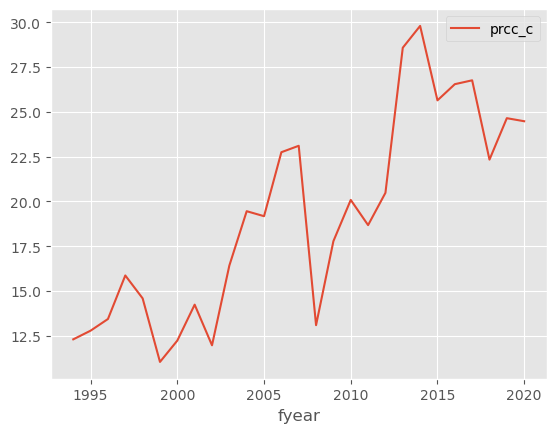

##### <font size = 4>5. Which firm was affected the most by the 2008 Financial Crisis, as measured by the percentage drop in stock price from 2007 to 2008?</font>
###### <font size = 3> ChatGPT Usage</font>
The original solution is generated by ChatGPT with following props:

> how do we find out 'Which firm was affected the most by the 2008 Financial Crisis, as measured by the percentage drop in stock price from 2007 to 2008?' using python and pandas

###### <font size = 3> Modification to Code Generated by ChatGPT</font>
we made following changes to the original solution:
- changed the column names to match the dataset
- wraped in UDF for reusability

###### <font size = 3>Function Explaination and Result</font>
The function takes the start year and end year as input and returns the firm name, gvkey, and the percentage drop in stock price from the start year to the end year. The function first filters the `df_focal_public_firms` by the start year and end year, then calculates the average stock price for each firm in the start year and end year, and calculates the percentage drop in stock price for each firm between given years.

We also apply the `idxmin()` method to get the index of the minimum value (which indicates the biggest drop), and this will yield the `'gvkey'` of the firm with biggest drop in stock price.

Finally we plug in the `'gvkey'` obtained in the previous step into the function `filter_by_col_value` and select the column `'conm'` to get the company name. Now we get a data frame with index and the target company name. We further apply `values[]` method to get the conpany name as a value. 

Print out the result in a sentence with the level of percentage drop and the company name.

```{python}
def find_most_affected_firm_during_period(start_year, end_year):
  df_start = filter_by_col_value(df_focal_public_firms, 'fyear', start_year)
  df_end = filter_by_col_value(df_focal_public_firms, 'fyear', end_year)

  avg_price_start = df_start.groupby('gvkey')['prcc_c'].mean()
  avg_price_end = df_end.groupby('gvkey')['prcc_c'].mean()

  percentage_drop = ((avg_price_end - avg_price_start) / avg_price_start) * 100

  most_affected_gvkey = percentage_drop.idxmin()
  most_affected_conm = filter_by_col_value(df_end, 'gvkey', most_affected_gvkey)['conm'].values[0]
  max_drop = abs(percentage_drop.min())

  print(f"The firm most affected between {start_year} and {end_year} is {most_affected_conm} (gvkey: {most_affected_gvkey}) with a drop of {max_drop}%.")
```

The firm most affected between 2007 and 2008 is CENTRAL ENERGY PARTNERS LP (gvkey: 161977) with a stock price drop around 92.71%.

##### <font size = 4>6. Plot the average Return on Assets (ROA) for the firms located in the “USA” across the years</font>
   
Use previously defined function `filter_by_col_value` to get data of the firms located in `'USA'`, add a column `'roa'` through calculations.
 
Apply `groupby()` method to get the `'roa'` mean value of each `'fyear'`. Then, plot the line accordingly.

```{python}
df_usa = filter_by_col_value(df_focal_public_firms, 'location', 'USA')
df_usa['roa'] = df_usa['ni'] / df_usa['asset']
avg_return_on_assets = df_usa.groupby('fyear')['roa'].mean()
avg_return_on_assets.plot.line()
```

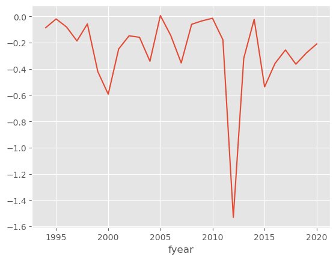

<div style="page-break-after: always;"></div>

### <font size = 6>Part 2. Text Analysis on the Industry Sector</font>
#### <font size = 5>C. Text Cleaning</font>
In this step we want to clean the `item_1_text` from data frame `df_2020_10K_item1` for word cloud generation and word embedding. The cleaning process includes:

  1. Convert all text to lower case with `.lower()` method.
  2. Remove punctuation with a translation table.
  3. Remove stop words in English get from `nltk.corpus` package.

We used the function from the course materials to conduct the cleaning process and return the cleaned text. Then we applied the function to the `item_1_text` column in `df_2020_10K_item1` and saved the cleaned text to a new column `item_1_clean`.
```{python}
translator = str.maketrans('', '', string.punctuation)
sw = stopwords.words('english')

def clean_text(text):
  #1.	Convert all words to lowercase.
  clean_text = text.lower()

  #2.	Remove punctuations.
  clean_text = clean_text.translate(translator)

  #3.	Remove stop words based on the list of English stop words in NLTK.
  clean_words = [w for w in clean_text.split() if w not in sw]

  return ' '.join(clean_words)
```
#### <font size = 5>D. Keyword Analysis</font>
##### <font size = 4>1. Merge 10-K Data with Firm Data</font>
Since 10-K data contains only the 10-K data for firms in 2020, we used `gvkey` and `year` key to perform an inner join with `df_focal_public_firms` on its `gvkey` and `fyear` key to create a new data frame named `df_filtered`. The new data frame contains 53 records and 11 columns.
```{python}
df_filtered=pd.merge(
  df_2020_10K_item1,
  df_focal_public_firms,
  left_on=['gvkey', 'year'],
  right_on=['gvkey', 'fyear'],
  how='inner'
)
```
##### <font size = 4>2. Generate Top 10 Keywords For Each Firm in 2 Methods</font>
###### <font size = 3>Method 1: Word Count</font>
A function from course material utilized `Counter` from `collections` package to count the frequency of each word in the `item_1_clean` column of `df_filtered`. Then we used `most_common()` method to get the top 10 words and their frequency for each firm. The result is saved in a new column named `top_10_keywords_count`.
```{python}
def get_top_keywords(text):
  c = Counter(text.split())
  words = []
  for pair in c.most_common(10):
    words.append(pair[0])
  return ' '.join(x[0] for x in c.most_common(10))
```
###### <font size = 3>Method 2: TF-IDF</font>
We also followed course material in this step. The function used `TfidfVectorizer` from `sklearn` package to calculate the TF-IDF matrix for each firm. Then we used `get_feature_names()` method to get the feature names  (words) that correspond to each column in the TF-IDF matrix. The function then loop through each document in `document_list` and perform following steps to get the top 10 keywords for each firm:
  1. Extracts the non-zero elements of the TF-IDF matrix for the current document using the nonzero() method.
  2. Calculates the TF-IDF scores for each non-zero element.
  3. Sorts the TF-IDF scores in descending order and selects the top 10 terms with the highest scores.
  4. Joins the top 10 terms into a single string and appends it to the top_keywords list.

The result is saved in a new column named `top_10_keywords_tfidf`.

<div style="page-break-after: always;"></div>

```{python}
def get_keywords_tfidf(document_list):
  '''
  Input: A list of documents (text)
  Output: The corresponding top 10 keywords for each document based on tf-idf values
  '''

  # Step 1: Create the TF-IDF vectorizer
  vectorizer = TfidfVectorizer()

  # Step 2: Calculate the TF-IDF matrix
  tfidf_matrix = vectorizer.fit_transform(document_list)

  # Step 3: Get feature names (words)
  feature_names = vectorizer.get_feature_names_out()

  # Step 4: Extract top 10 keywords for each text
  top_keywords = []
  for i in range(len(document_list)):

    if i %100 == 0:
      print(f'Processing the {i}/{len(document_list)} document.')

    feature_index = tfidf_matrix[i, :].nonzero()[1]
    tfidf_scores = zip(feature_index, [tfidf_matrix[i, x] for x in feature_index])
    sorted_tfidf_scores = sorted(tfidf_scores, key=lambda x: x[1], reverse=True)
    top_keywords.append(' '.join([feature_names[i] for i, _ in sorted_tfidf_scores[:10]]))

  return top_keywords
```
##### <font size = 4>3. Wordcloud Generation</font>
We first defined an UDF for wordcloud generation to improve code reuseability:
```{python}
def create_wordcloud(text, title = None):
  wordcloud = WordCloud(width=1000, height=618, background_color='white').generate(text) # note that text is a string, not a list

  plt.imshow(wordcloud)
  plt.axis('off')
  plt.title(title)

  plt.show()
```
Then we utilized the UDF and key words extracted in the previous steps to generate word clouds for each method.

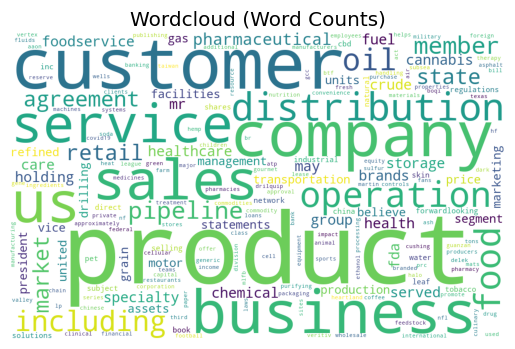

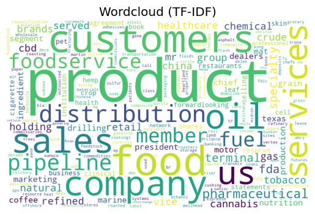


#### <font size = 5>E. Word Embedding</font>
##### <font size = 4>1. Train Word2Vec Model</font>
Consider the time consumption of training the `Word2Vec` model each time, we created an function to load the model if it's already trained and saved in the `data` folder. Otherwise, the function will train the model with cleaned text in full 10-K sample and save it to the `data` folder.

<div style="page-break-after: always;"></div>

```{python}
def get_model(sent):
  path = './data/word2vec.model'
  # load the model if it exists to save time
  if os.path.exists(path):
    return Word2Vec.load(path)
  # otherwise, train the model and save it
  model = Word2Vec(sent, min_count=1, vector_size=50, workers=3, window=3, sg = 1)
  model.save(path)
  return model
```
##### <font size = 4>2. Representative Key Words and Their Most Relevant Words</font>
Based on our wordclouds we selected 'product', 'food', and 'oil' as our representative key words. Then we used `model.wv.most_similar` method to get the most relevant words for each representative key word, and we get following results:
  - 'product': 'sugardown®', 'twirla', 'contrapest', 'apcannabinoids', 'codit'
  - 'food': 'meat', 'beverage', 'perishable', 'poultry', 'foods'
  - 'oil': 'gas', 'crude', 'natural', 'condensate', 'ngls'


### <font size = 6>Part 3. Comprehensive Analysis of Focal Firm</font>
#### <font size = 5>F. Firm Analysis and Strategy Suggestion</font>
##### <font size = 4>Part I. Data Processing and Visualization</font>
###### <font size = 3>1. Firm Selection and Competing Firms</font>
Among the firms in our focal major industry we picked SYSCO CORP (gvkey: 10247) as our focal firm. To find its competing firms, we create the firm-level embedings with `DocumentSimilarity.py` prepared by the BAIT 508 instruction team and the model we trained in previous steps. Then we used `most_similar` method of `DocumentSimilarity` class to get the 5 most similar firms to our focal firm.

```{python}
d = DocumentSimilarity(
    model = model,
    gvkeys = df_filtered['gvkey'],
    conm = df_filtered['conm'],
    keywordslist = df_filtered['top_10_keywords_tfidf']
)
```

The competing firms are:
   - UNITED NATURAL FOODS INC (gvkey: 63927)
   - SPARTANNASH CO (gvkey: 28762)
   - CORE MARK HOLDING CO INC (gvkey: 162876)
   - PRESTIGE CONSUMER HEALTHCARE (gvkey: 162335)
   - CHEFS' WAREHOUSE INC (gvkey: 186960)

###### <font size = 3>2. Revenue, Market Share, and ROA Analysis Cross Competing Firms</font>
Firstly, we created a new data frame named `df_compirison` from `df_filtered`. The new data frame contains only the focal firm and its competitors with their `gvkey`, `conm`, `sale`, and `roa` columns. Then we calculated the market share of each firm by dividing its `sale` by the sum of `sale` of all firms in the data frame. The result is saved in a new column named `market_share`. Because of the calculation method, the market share is the relevant ratio among the competing firms and does not represent the absolute market shares among all competitors in the industry, as only 5 most similar firms are included.
```{python}
df_comparison = df_filtered[df_filtered['gvkey'].isin(comparison_gvkeys)][['gvkey', 'conm', 'sale', 'roa']]

df_comparison['market_share'] = df_comparison['sale'] / df_comparison['sale'].sum()
```
We visulized the comparisons of `revenue` and `roa` between the focal firm and its competitors with bar charts:

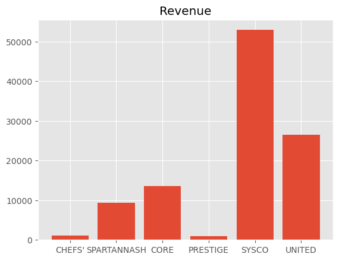

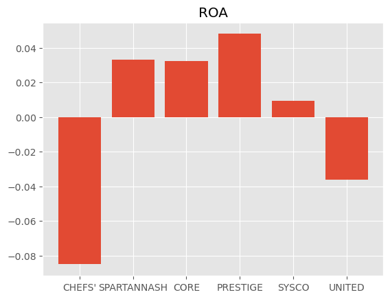

We also visulized the market share of each firm with a pie chart:

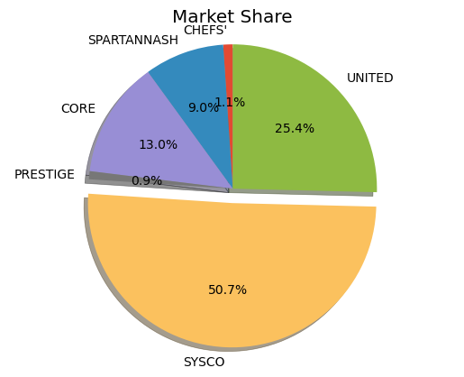

###### <font size = 3>3. Analyze Focal Firm's Historical Performance</font>
Based on `df_focal_public_firms` we created new data frame `df_focal_firm_historical` containing the focal firm's historical `prcc_c`, `roa`, `sale`, and `asset` data with `fyear`.
```{python}
cols = ['fyear', 'prcc_c', 'roa', 'sale', 'asset']
df_focal_firm_historical = filter_by_col_value(df_focal_public_firms, 'gvkey', focal_firm_gvkey)[cols]
```
Then we visualized the focal firm's historical performance with line charts:

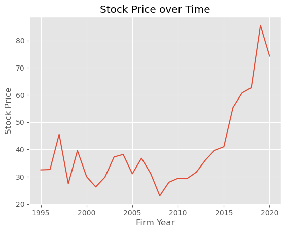

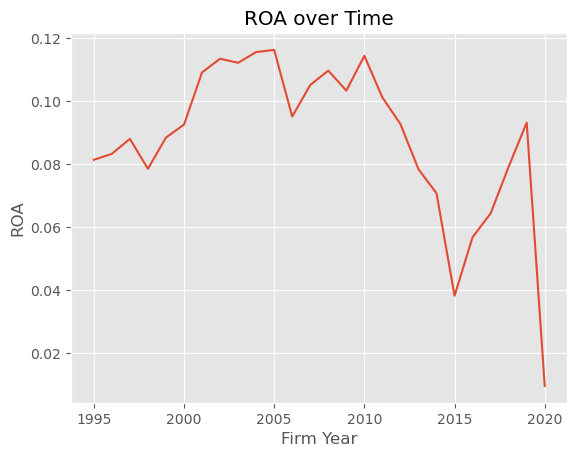

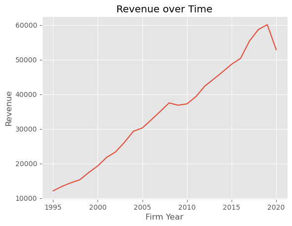

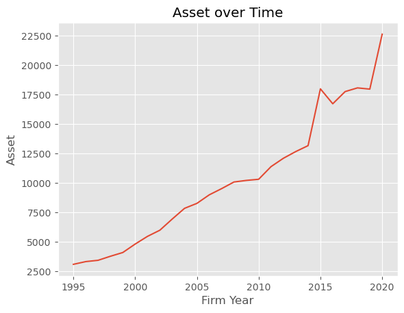

<div style="page-break-after: always;"></div>

#### <font size = 4>Part II. Data Analysis and Strategy Suggestions</font>

**Chosen topic**: Competition Analysis and Strategy Suggestions
**Chosen question**: Question F.2. Compare the revenue, market share, and ROA of the focal firm to its competitors and provide suggestions accordingly.

##### <font size = 3>Section 1. Overview of Firms in Wholesale Non-Durable Goods Sector</font>

| GVKEY | Firm Name                        | Revenue ($M) | ROA        | Market Share  |
|-------|----------------------------------|--------------|------------|---------------|
| 6     | CHEFS' WAREHOUSE INC             | 1111.631     | -0.085088  | 0.010645      |
| 9     | SPARTANNASH CO                   | 9348.485     | 0.033334   | 0.089521      |
| 17    | CORE MARK HOLDING CO INC         | 13617.100    | 0.032332   | 0.130397      |
| 31    | PRESTIGE CONSUMER HEALTHCARE     | 943.365      | 0.048022   | 0.009034      |
| 44    | SYSCO CORP                       | 52893.310    | 0.009522   | 0.506504      |
| 45    | UNITED NATURAL FOODS INC         | 26514.267    | -0.036133  | 0.253900      |


##### <font size = 3>Section 2. Competitive Analysis</font>

* **Revenue**: 
  - Sysco Corp is the leading revenue generator with a revenue of $52,893.310M. When compared with the second player, UNITED NATURAL FOODS INC, Sysco's revenue is roughly twice as much ($52,893.310M vs. $26,514.267M). Compared to the third player, CORE MARK HOLDING CO INC, Sysco’s revenue is approximately four times greater. This indicates that Sysco has a commanding presence in terms of generating sales and reaching customers.

* **Market Share**: 
  - **Market Leaders**: Firms with a market share greater than 20%. This category only includes Sysco Corp (50.65%) and UNITED NATURAL FOODS INC (25.39%). Their combined market share signifies that they hold a dominant position in the industry.
  
  - **Challengers**: Firms with a market share between 5% and 20%. In this category, we have CORE MARK HOLDING CO INC (13.04%) and SPARTANNASH CO (8.95%). These firms have a respectable presence but are notably smaller than the market leaders.
  
  - **Long-Tail Players**: Firms with a market share less than 5%. This category includes CHEFS' WAREHOUSE INC (1.06%) and PRESTIGE CONSUMER HEALTHCARE (0.90%). Their low market share signifies they might be serving niche segments or might be regional players with limited scale compared to the leaders and challengers.

* **ROA (Return on Assets)**: 
  - **High Performance (ROA > 3%)**: This includes PRESTIGE CONSUMER HEALTHCARE (4.80%), SPARTANNASH CO (3.33%), and CORE MARK HOLDING CO INC (3.23%).
  
  - **Average Performance (ROA between 0% and 3%)**: This category only includes Sysco Corp with an ROA of 0.95%. Given its size, this indicates potential inefficiencies in asset utilization.
  
  - **Low Performance (ROA < 0%)**: This category includes CHEFS' WAREHOUSE INC (-8.51%) and UNITED NATURAL FOODS INC (-3.61%), suggesting significant operational challenges or external pressures affecting profitability.

* **Overall Performance Assessment**: 
  - While Sysco clearly leads in revenue, its ROA performance is suboptimal. This could be a result of high asset base, potential inefficiencies, or investments that have yet to yield returns. Conversely, the second revenue runner-up, UNITED NATURAL FOODS INC, is also underperforming in terms of ROA. The presence of high ROA but low market share for PRESTIGE CONSUMER HEALTHCARE might suggest a light-asset operating model, indicating they might be leveraging efficiencies, perhaps through outsourcing, reduced infrastructure, or a unique business model that does not require significant asset holdings.

---

This enhanced analysis provides a more detailed perspective of each firm's position in the wholesale non-durable goods industry. It is essential for firms to not only understand where they stand but also understand the operational and strategic nuances of their competitors.


##### <font size = 3>Section 3. Strategy Suggestions for SYSCO</font>

* **Revenue and Market Share**: Sysco's dominant position in revenue and market share suggests a strong hold in the industry. However, there's always a risk of becoming complacent. Sysco should continuously innovate its offerings and strengthen relationships with suppliers and customers. Exploring new markets and diversifying product lines can be an avenue for growth.

* **Improving ROA**: Sysco's ROA is relatively low, especially compared to smaller competitors like PRESTIGE CONSUMER HEALTHCARE. This indicates room for improvement in asset management and efficiency. A comprehensive review of asset utilization, investments, and operational efficiencies can enhance this metric.

* **Threat from Competitors**: While Sysco enjoys a substantial lead, competitors like UNITED NATURAL FOODS INC and CORE MARK HOLDING CO INC are significant players. Monitoring their strategies, and staying alert to industry shifts, is crucial.

* **Leverage Economies of Scale**: Sysco's large scale offers opportunities to negotiate better terms with suppliers, optimize logistics, and implement cost-saving technologies. Investing in supply chain technologies and infrastructure can further solidify its position.

* **Focus on Sustainability and ESG**: Given the current global trend, Sysco can further differentiate itself by integrating sustainability into its operations and committing to Environmental, Social, and Governance (ESG) goals.

In conclusion, Sysco's dominance in the wholesale non-durable goods industry is clear. However, continuously refining strategies based on competition analysis is essential to maintain and expand its leadership position.
